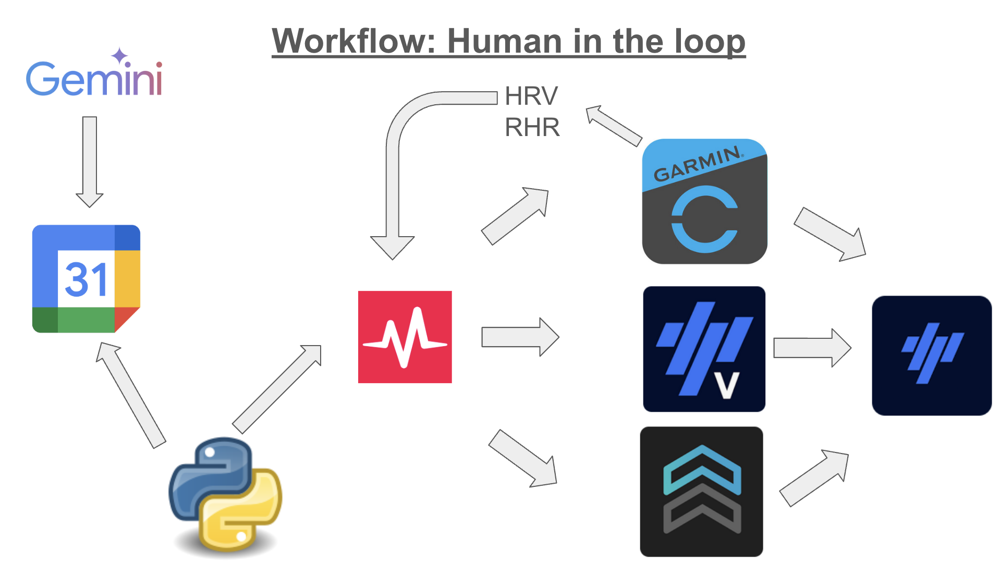

# ⛰️ Project Chiang M-AI


> [!TIP]
> **Featured in Episode 4: [The "Zero-UI" Warehouse: Shipping AI Plans to Production](https://nakmuaycoder.github.io/nakmuaycoder-r-d-lab/posts/project-chiang-m-ai/04-the-automation-warehouse/)**

**Project Chiang M-AI** syncs AI-generated training plans (from Gemini/ChatGPT) to your training devices (Garmin, Wahoo, smart trainers) via **Intervals.icu**.

## ⛰️ Project Chiang M-AI

This project is the technical implementation of **Project Chiang M-AI**, an R&D initiative documenting the use of LLMs, Python automation, and system engineering to prepare for the **Hoka Chiang Mai 160km** (100 miles) ultra-trail.

Full story, technical deep dives, and ongoing architectural logs are available at:
👉 **[Project Chiang M-AI: Fine-Tuning the Fighter](https://nakmuaycoder.github.io/nakmuaycoder-r-d-lab/posts/project-chiang-m-ai/)**

*(Series includes: AI Board of Directors, Adversarial Validation, Agile Runtime Loops, and more.)*

## 🏗️ Architecture & Workflow



### The Problem
You generate training plans with frontier LLMs (Gemini 3, ChatGPT 5.2), but getting them to your devices is manual and tedious.

### The Solution
**Project Chiang M-AI** bridges the gap:

```
Gemini/ChatGPT (plan generation)
    ↓ (copy JSON to calendar)
Google Calendar
    ↓ (automated sync)
Project Chiang M-AI CLI → Intervals.icu
    ↓ (automatic sync)
Garmin Watch / Wahoo Computer / Smart Trainers
```

**Intervals.icu** acts as the middleware, automatically syncing workouts to all major platforms (TrainingPeaks Virtual, Garmin Connect, Wahoo, etc.).

## 🚀 Quick Start

### Installation

1. **Clone the repository:**
   ```bash
   git clone https://github.com/nakmuaycoder/project-chiang-m-ai.git
   cd project-chiang-m-ai
   ```

2. **Install uv (if needed):**
   - Windows: `powershell -c "irm https://astral.sh/uv/install.ps1 | iex"`
   - Mac/Linux: `curl -LsSf https://astral.sh/uv/install.sh | sh`

3. **Run installation:**
   ```bash
   make install
   ```

### Configuration

Create a `.env` file with your API keys:

```bash
# Required
INTERVALS_ATHLETE_ID=i12345
INTERVALS_API_KEY=your_intervals_key_here
GOOGLE_CALENDAR_CREDENTIALS_FILE=path/to/credentials.json

# Optional
PERIODIZATION=3:1  # or "2:1" (default: 3:1)
```

**Get your credentials:**
- **Intervals.icu**: Settings → Developer Settings
- **Google Calendar**: [Google Cloud Console](https://console.cloud.google.com)

**Quick setup with script:**
```bash
uv run setup_keys.py --intervals_id="i12345" \
                      --intervals_key="YOUR_KEY" \
                      --calendar_creds="path/to/credentials.json" \
                      --periodization="3:1"
```

**Or copy `.env.example` to `.env` and fill in your values.**

### Google Calendar Setup

1. Go to [Google Cloud Console](https://console.cloud.google.com)
2. Create a new project (or use existing)
3. Enable **Google Calendar API**
4. Create OAuth 2.0 credentials (Desktop app)
5. Download `credentials.json`
6. Set path in `.env`: `GOOGLE_CALENDAR_CREDENTIALS_FILE=path/to/credentials.json`
7. First run will open browser for authorization

## 📖 Usage

### Sync Workouts to Devices

**Sync current training block:**
```bash
python -m project_chiang_m_ai sync --block
```
Syncs 28 days (3:1 periodization) or 21 days (2:1 periodization) based on your `.env` config.

**Other sync options:**
```bash
# This week (7 days)
python -m project_chiang_m_ai sync --week

# Today only
python -m project_chiang_m_ai sync --today

# Custom number of days
python -m project_chiang_m_ai sync --days 14

# Dry run (parse but don't upload)
python -m project_chiang_m_ai sync --block --dry-run
```

### Check Status

```bash
# Show sync statistics
python -m project_chiang_m_ai status

# List all synced workouts
python -m project_chiang_m_ai status --list
```

### Clean Up

```bash
# Delete all synced workouts from Intervals.icu
python -m project_chiang_m_ai clean

# Skip confirmation prompt
python -m project_chiang_m_ai clean -y

# Also clear sync database
python -m project_chiang_m_ai clean --clear-db
```

### Help

```bash
# Show all commands
python -m project_chiang_m_ai --help

# Command-specific help
python -m project_chiang_m_ai sync --help
```

## 🔄 Workflow

1. **Generate your training plan** using Gemini 2.0 or ChatGPT o1
2. **Copy workout JSON** to Google Calendar event descriptions
3. **Sync to devices**: `python -m project_chiang_m_ai sync --block`
4. **Your workouts appear** on Garmin/Wahoo/trainer apps automatically!

## 🛠️ Tech Stack

- **Language:** Python 3.12+
- **Package Manager:** [uv](https://github.com/astral-sh/uv)
- **Linters:** Ruff, Pre-commit, Detect-secrets
- **APIs:** Intervals.icu, Google Calendar
- **Architecture:** Provider-agnostic interfaces (swap Google Calendar → Outlook, etc.)

## 📂 Project Structure

```
project-chiang-m-ai/
├── src/project_chiang_m_ai/
│   ├── __main__.py          # CLI entry point
│   ├── cli.py               # CLI commands
│   ├── config.py            # Configuration
│   ├── factory.py           # Provider factories
│   │
│   ├── interfaces/          # Abstract interfaces
│   │   ├── workout_source.py
│   │   └── calendar.py
│   │
│   ├── clients/             # API clients
│   │   ├── google_calendar.py
│   │   └── intervalicu.py
│   │
│   ├── sources/             # Workout sources
│   │   └── calendar_source.py
│   │
│   ├── services/            # Business logic
│   │   ├── coach.py
│   │   └── workout_tracker.py
│   │
│   └── models/              # Data models
│       └── workout.py
│
├── data/                    # Sync history database
├── docs/                    # Documentation
├── templates/               # Workout templates
└── tests/                   # Test scripts
```

## 🎯 Periodization

The CLI supports training periodization patterns:

- **3:1** (default): 28-day blocks (3 weeks load + 1 week recovery)
- **2:1**: 21-day blocks (2 weeks load + 1 week recovery)

Set in `.env`:
```env
PERIODIZATION=3:1
```

Then sync your entire block:
```bash
python -m project_chiang_m_ai sync --block  # Auto-calculates 21 or 28 days
```

## 📝 License

MIT License - see LICENSE file for details.
