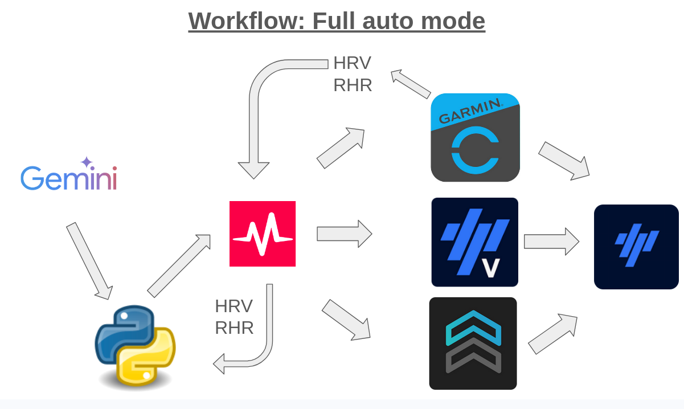

# ⛰️ Project Chiang M-AI


> [!TIP]
> **Technical Deep Dives:**
> - **Episode 4**: [The "Zero-UI" Warehouse: Shipping AI Plans to Production](https://nakmuaycoder.github.io/nakmuaycoder-r-d-lab/posts/project-chiang-m-ai/04-the-automation-warehouse/)
> - **Episode 5**: [Full Auto Mode (Wellness-Based Adaptation)](https://nakmuaycoder.github.io/nakmuaycoder-r-d-lab/posts/project-chiang-m-ai/05-wellness-based-adaptation/)
>
> 🔖 **Version Control**: Use Git tags (e.g., `git checkout episode-5-v1.1.0`) to access the specific code state discussed in each post.

**Project Chiang M-AI** syncs AI-generated training plans (from Gemini/ChatGPT) to your training devices (Garmin, Wahoo, smart trainers) via **Intervals.icu**.

## ⛰️ Project Chiang M-AI

This project is the technical implementation of **Project Chiang M-AI**, a personal R&D initiative documenting the use of LLMs, Python automation, and system engineering to prepare for the **Hoka Chiang Mai 160km** (100 miles) ultra-trail.

Full story, technical deep dives, and ongoing architectural logs are available at:
👉 **[Project Chiang M-AI: Fine-Tuning the Fighter](https://nakmuaycoder.github.io/nakmuaycoder-r-d-lab/posts/project-chiang-m-ai/)**

### 📚 Series Overview & Releases

| Episode | Blog Post | Git Tag | Focus |
| :--- | :--- | :--- | :--- |
| **Ep. 5** | [Full Auto Mode (Wellness-Based Adaptation)](https://nakmuaycoder.github.io/nakmuaycoder-r-d-lab/posts/project-chiang-m-ai/05-wellness-based-adaptation/) | `episode-5-v1.1.0` | Modular Brains, LLM Adaptation, Testing |
| **Ep. 4** | [The Zero-UI Warehouse](https://nakmuaycoder.github.io/nakmuaycoder-r-d-lab/posts/project-chiang-m-ai/04-the-automation-warehouse/) | `episode-4 v1.0.0` | Google Calendar API + Intervals.icu Sync |

## 🏗️ Architecture & Workflow


### Wellness-Based Adaptive Workflow (Full Auto)



### Modular Design: Brain vs. Platform

As of Episode 5, the project has been refactored for maximum modularity using a **Brain vs. Sport Platform** architecture.

- **The Brain (`IBrain`)**: The "Decision Maker". It decides what the final workout should be.
    - `GoogleCalendarBrain`: Blindly trusts the manual plans in your calendar.
    - `AutoAdaptiveBrain`: Uses an LLM to adapt plans based on your wellness data.
    - `MockFileBrain`: Reads from a local JSON for testing.
- **The Sport Platform (`ISportPlatform`)**: The "Executioner". It handles data I/O and display.
    - `IntervalicuClient`: Pushes workouts to the real Intervals.icu platform.
    - `LocalArchivePlatform`: Saves workouts as local JSON files (perfect for comparing AI outputs safely).

### The Workflow

```
Google Calendar (Manual Plan)
    ↓
Brain (Decides: Keep, Adapt, or Mock)
    ↓
Sport Platform (Executes: Sync to Intervals.icu or Save Locally)
    ↓
Devices (Garmin, Wahoo, etc.)
```

**Intervals.icu** acts as the primary middleware for wellness data and syncing workouts to all major platforms.

## 🚀 Quick Start

### Installation

1. **Clone the repository:**
   ```bash
   git clone https://github.com/nakmuaycoder/project-chiang-m-ai.git
   cd project-chiang-m-ai
   ```

2. **Install uv (if needed):**
   - Windows: `powershell -c "irm https://astral.sh/uv/install.ps1 | iex"`
   - Mac/Linux: `curl -LsSf https://astral.sh/uv/install.sh | sh`

3. **Run installation:**
   ```bash
   make install
   ```

### Configuration

1. **Environment Variables**: Create a `.env` file for credentials:
```bash
INTERVALS_ATHLETE_ID=i12345
INTERVALS_API_KEY=your_intervals_key_here
GOOGLE_CALENDAR_CREDENTIALS_FILE=path/to/credentials.json
GEMINI_API_KEY=your_gemini_api_key_here
```

2. **App Configuration**: Customize the modular behavior in `coach_config.yaml`:
```yaml
coach:
  brain:
    type: "auto"      # "manual", "auto", or "mock"
    sync_mode: "today" # "today" or "all"
  destination:
    type: "intervals_icu" # "intervals_icu" or "local_storage"
```

**Get your credentials:**
- **Intervals.icu**: Settings → Developer Settings
- **Google Calendar**: [Google Cloud Console](https://console.cloud.google.com)

**Quick setup with script:**
```bash
uv run setup_keys.py --intervals_id="i12345" \
                      --intervals_key="YOUR_KEY" \
                      --calendar_creds="path/to/credentials.json" \
                      --periodization="3:1"
```

**Or copy `.env.example` to `.env` and fill in your values.**

### Google Calendar Setup

1. Go to [Google Cloud Console](https://console.cloud.google.com)
2. Create a new project (or use existing)
3. Enable **Google Calendar API**
4. Create OAuth 2.0 credentials (Desktop app)
5. Download `credentials.json`
6. Set path in `.env`: `GOOGLE_CALENDAR_CREDENTIALS_FILE=path/to/credentials.json`
7. First run will open browser for authorization

## 📖 Usage

### Sync Workouts to Devices

**Sync current training block:**
```bash
python -m project_chiang_m_ai sync --block
```
Syncs 28 days (3:1 periodization) or 21 days (2:1 periodization) based on your `.env` config.

**Other sync options:**
```bash
# This week (7 days)
python -m project_chiang_m_ai sync --week

# Today only
python -m project_chiang_m_ai sync --today

# Custom number of days
python -m project_chiang_m_ai sync --days 14

# Dry run (parse but don't upload)
python -m project_chiang_m_ai sync --block --dry-run
```

### Wellness Adaptation

**Let the LLM dynamically adjust your daily training based on Heart Rate Variability (HRV) and Resting Heart Rate (RHR) tracked in Intervals.icu.**

```bash
# Adapt today's planned workouts based on fatigue trends
python -m project_chiang_m_ai adapt
```
If your readiness is low, the LLM will automatically replace intense VO2 max intervals with easy Z1/Z2 recovery or a rest day within your Google Calendar before syncing!

### Check Status

```bash
# Show sync statistics
python -m project_chiang_m_ai status

# List all synced workouts
python -m project_chiang_m_ai status --list
```

### Clean Up

```bash
# Delete all synced workouts from Intervals.icu
python -m project_chiang_m_ai clean

# Skip confirmation prompt
python -m project_chiang_m_ai clean -y

# Also clear sync database
python -m project_chiang_m_ai clean --clear-db
```

### Help

```bash
# Show all commands
python -m project_chiang_m_ai --help

# Command-specific help
python -m project_chiang_m_ai sync --help
```

## 🔄 Workflow

1. **Generate your training plan** using Gemini 2.0 or ChatGPT o1
2. **Copy workout JSON** to Google Calendar event descriptions
3. **Sync to devices**: `python -m project_chiang_m_ai sync --block`
4. **Your workouts appear** on Garmin/Wahoo/trainer apps automatically!

## 🛠️ Tech Stack

- **Language:** Python 3.12+
- **Package Manager:** [uv](https://github.com/astral-sh/uv)
- **Linters:** Ruff, Pre-commit, Detect-secrets
- **APIs:** Intervals.icu, Google Calendar
- **Architecture:** Provider-agnostic interfaces (swap Google Calendar → Outlook, etc.)

## 📂 Project Structure

```
project-chiang-m-ai/
├── src/project_chiang_m_ai/
│   ├── __main__.py          # Entry point
│   ├── cli.py               # CLI Commands (sync, adapt, status)
│   ├── factory.py           # Dependency Injection (injects Brain/Platform)
│   │
│   ├── brains/              # Workout Logic
│   │   ├── base_calendar_brain.py
│   │   ├── auto_brain.py    # LLM adaptation
│   │   └── calendar_brain.py # Manual focus
│   │
│   ├── clients/             # API & Platform Clients
│   │   ├── intervalicu.py
│   │   ├── google_calendar.py
│   │   └── local_platform.py # For local testing
│   │
│   ├── interfaces/          # Abstractions (IBrain, ISportPlatform)
│   │
│   ├── services/            # Orchestration
│   │   ├── coach.py         # The Conductor
│   │   └── workout_tracker.py
│   │
│   └── models/              # Pydantic Models (Workout, Step)
│
├── coach_config.yaml        # Main modular config
├── .env                     # Private secrets
├── data/                    # Sync history & Local archives
└── tests/                   # Test suite
```

## 🎯 Periodization

The CLI supports training periodization patterns:

-   **3:1** (default): 28-day blocks (3 weeks load + 1 week recovery)
-   **2:1**: 21-day blocks (2 weeks load + 1 week recovery)

Set in `.env`:
```env
PERIODIZATION=3:1
```

Then sync your entire block:
```bash
python -m project_chiang_m_ai sync --block  # Auto-calculates 21 or 28 days
```

## 📝 License

MIT License - see LICENSE file for details.
